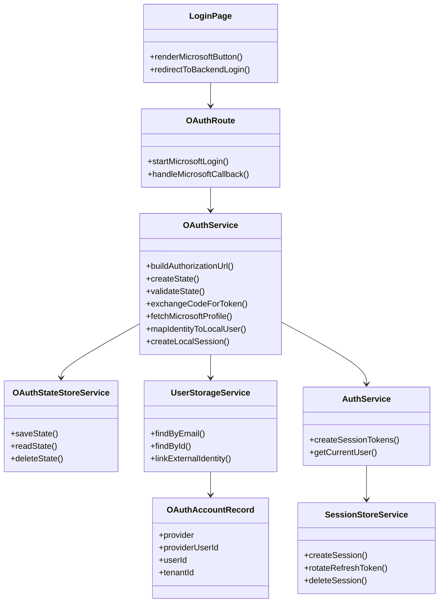

# OAuth Setup Reference

Developer: Ravi Kafley

This document is a forward-looking implementation note for Microsoft OAuth / Entra ID so we can resume the work later without re-planning from scratch.

## Goal

Add `Continue with Microsoft` to the Torilaure login flow using a backend-managed OAuth authorization code flow.

## Recommended Stack

Frontend:
- existing React + React Router login page
- browser redirect to backend OAuth start endpoint

Backend:
- existing FastAPI platform core
- Microsoft identity endpoints through standard OAuth 2.0 / OpenID Connect
- existing JWT/session layer for local platform sessions after Microsoft identity is validated

Libraries To Add Later

Python:
- `httpx` for OAuth token and userinfo exchange
- optionally `python-jose` or keep `PyJWT` if we continue with our current JWT handling
- optionally `msal` if we want a Microsoft-specific SDK instead of raw OIDC HTTP calls

Frontend:
- no required new library if we keep backend redirect flow
- optional `@azure/msal-browser` only if we later choose client-side Microsoft auth, which is not the current recommendation

## Planned Files To Create

Backend:
- `platform-core/app/api/routes/oauth.py`
- `platform-core/app/services/oauth_service.py`
- `platform-core/app/schemas/oauth.py`
- `platform-core/app/models/oauth_tables.py`
- `platform-core/app/services/oauth_state_store_service.py`
- Alembic migration for OAuth accounts / state storage

Frontend:
- reuse `frontend-app/src/pages/LoginPage.jsx`
- optionally add `frontend-app/src/api/oauthClient.js`
- optionally add `frontend-app/src/pages/OAuthCallbackPage.jsx` if we later need a dedicated frontend callback screen

Config:
- extend `platform-core/app/core/config.py`
- extend `platform-core/.env.example`

## Planned Environment Variables

- `MICROSOFT_CLIENT_ID`
- `MICROSOFT_CLIENT_SECRET`
- `MICROSOFT_TENANT_ID`
- `MICROSOFT_REDIRECT_URI`
- `MICROSOFT_SCOPES`
- `MICROSOFT_AUTHORITY_URL`

## Recommended File Responsibilities

`platform-core/app/api/routes/oauth.py`
- `GET /auth/microsoft/login`
- `GET /auth/microsoft/callback`
- optional `POST /auth/microsoft/logout`

`platform-core/app/services/oauth_service.py`
- build authorization URL
- create and validate OAuth state
- exchange authorization code for tokens
- fetch Microsoft user profile
- map external identity to local user / tenant
- mint local Torilaure JWT session

`platform-core/app/schemas/oauth.py`
- callback payloads
- external identity profile
- linked account response models

`platform-core/app/models/oauth_tables.py`
- linked external identities
- OAuth state records if we choose PostgreSQL
- optional refresh token metadata if we store Microsoft refresh context

`platform-core/app/services/oauth_state_store_service.py`
- Redis-backed state and nonce handling
- expiration and replay protection

## Planned Frameworks And Libraries Imported

FastAPI route layer:
- `APIRouter`
- `Depends`
- `HTTPException`
- `Request`
- `Response`
- `status`

HTTP and security helpers:
- `httpx`
- `secrets`
- `urllib.parse`
- `datetime`
- `json`

Existing Torilaure backend modules that OAuth should reuse:
- `app.core.config`
- `app.schemas.auth`
- `app.services.auth_service`
- `app.services.user_storage_service`
- `app.services.session_store_service`
- `app.services.audit_service`
- `app.services.authorization_service`
- `app.core.redis_client`

Frontend imports likely needed:
- `useEffect`
- `useNavigate`
- `useLocation`
- existing `setSession`
- existing `loginWithPassword` can remain for local fallback

## Planned Import Skeleton

Backend route example:

```python
from fastapi import APIRouter, HTTPException, Request, status

from app.core.config import settings
from app.schemas.auth import AuthSession
from app.services.audit_service import audit_service
from app.services.oauth_service import oauth_service
```

Backend service example:

```python
import secrets
from datetime import UTC, datetime, timedelta
from urllib.parse import urlencode

import httpx

from app.core.config import settings
from app.services.auth_service import auth_service
from app.services.session_store_service import session_store_service
from app.services.user_storage_service import user_storage_service
```

Frontend login page additions:

```jsx
import { useNavigate } from "react-router-dom";
```

Optional frontend OAuth callback page:

```jsx
import { useEffect } from "react";
import { useNavigate, useSearchParams } from "react-router-dom";
import { setSession } from "../auth";
```

## Suggested Flow

1. User clicks `Continue with Microsoft`
2. Frontend redirects browser to backend `/api/v1/auth/microsoft/login`
3. Backend creates `state` and `nonce`, stores them in Redis, then redirects to Microsoft
4. Microsoft redirects back to backend callback endpoint with authorization code
5. Backend validates `state`, exchanges code for Microsoft tokens, and reads user identity claims
6. Backend links or creates a local Torilaure user record
7. Backend creates the normal Torilaure JWT session and redirects back to frontend
8. Frontend stores the session and enters the normal protected-route flow

## Class Diagram



## Implementation Notes

- Keep Microsoft OAuth backend-driven first.
- Reuse the existing Torilaure JWT/session contract after Microsoft login succeeds.
- Store OAuth `state` in Redis with short TTL and single use.
- Record login success/failure through `audit_service`.
- Keep the local email/password login path available until Microsoft OAuth is stable.
